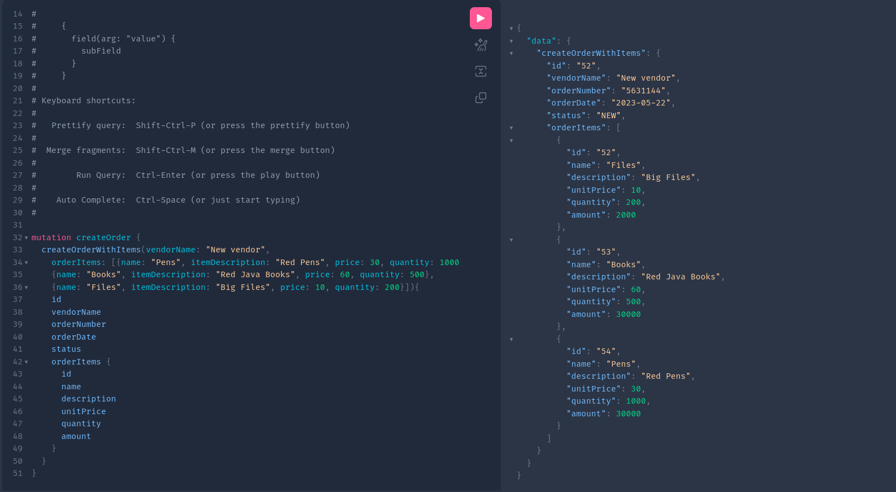
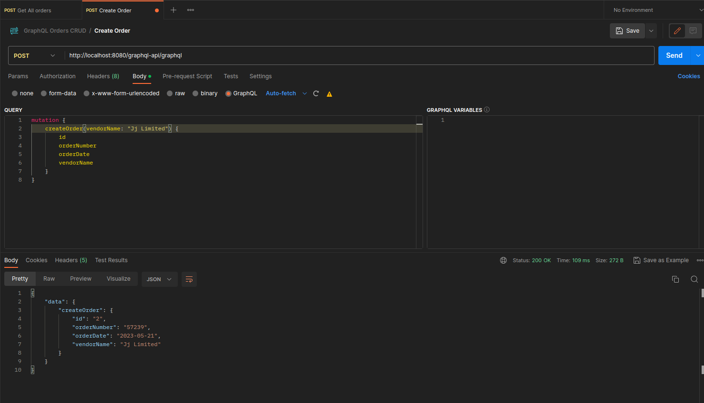
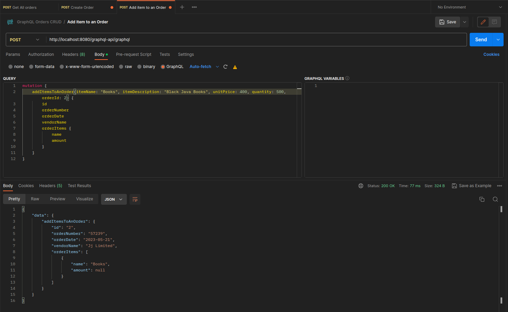
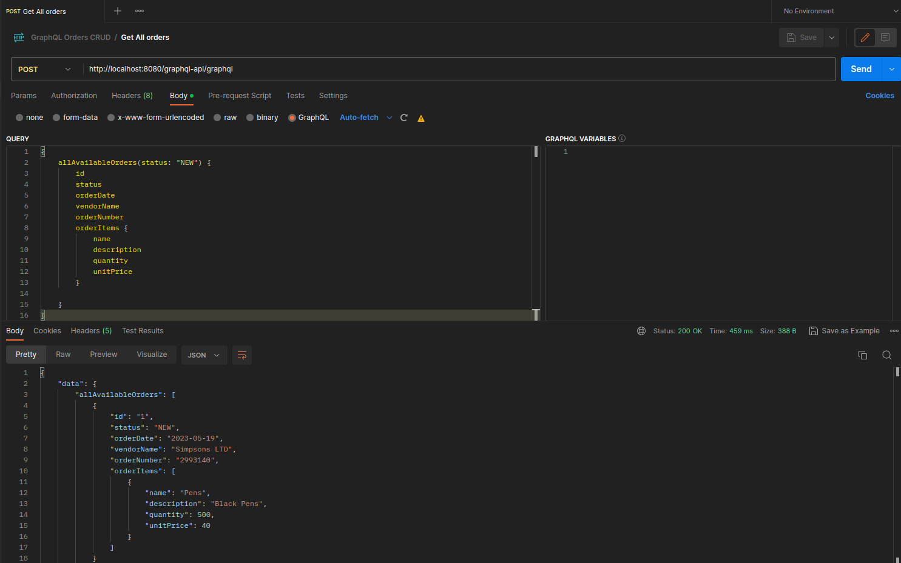
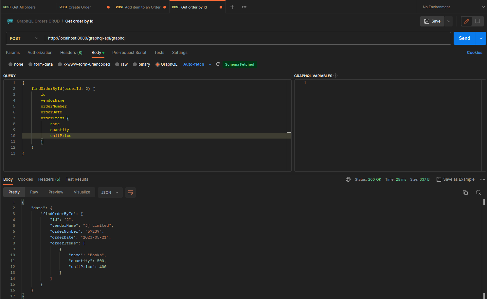

# GrapgQL Spring Boot CRUD Example

This is a sample CRUD GraphQL API server.

## Run
- Run `./gradlew bootRun` or using your IDE.

## Testing
- This is a simple order API. Create order add items in the order.

### Create Order together with items

[]

### Create Order without items

[]

### Add order items to an order

[]

### Retrieve All Orders

[]

### Get Order By Id

[]