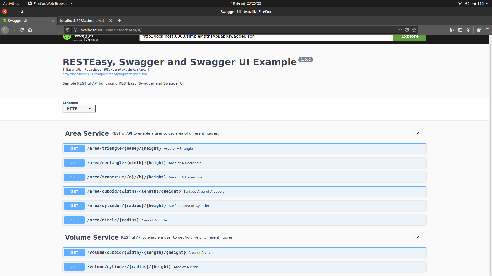
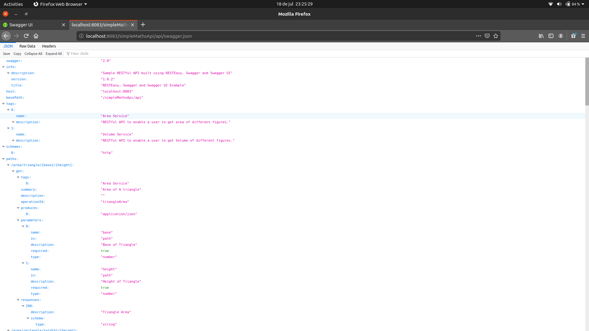

# JAX-RS SAMPLE MATHS WEB SERVICE WITH SWAGGER 

This is a sample JAX-RS MATHS application that runs on tomcat server. 

## Necessary Updates
- My context path is `simpleMathsApi` (name of the war file) and port `8083`. Make necessary changes if your tomcat port is different.
- Open `com.maths.config.SwaggerConfiguration.java` and `webapp/index.html` and change tomcat port if necessary from 8083 to one on your tomcat port.

## Deploy Project
- Change directory to project folder and  run `mvn clean install`  to create war file.
- Rename your war file to `simpleMathsApi`. 
- Deploy the war file in tomcat application server and go to `http://localhost:8083/simpleMathsApi/` for Swagger api documentation.
- View below an example of finding the area of a trapezium.

## What's Included 
- Finding area of simple figures
- Finding volume of simple figures
- SWAGGER Documentation

This is a Swagger UI
[]

This is Swagger Json
[]

This is an Example
[]

## Used Tech
- Servlet
- JAX-RS
- SWAGGER Documentation

### From Developers

I am always happy to receive your feedback!
FInd me on [Twitter](https://twitter.com/julian_geniuz)!
