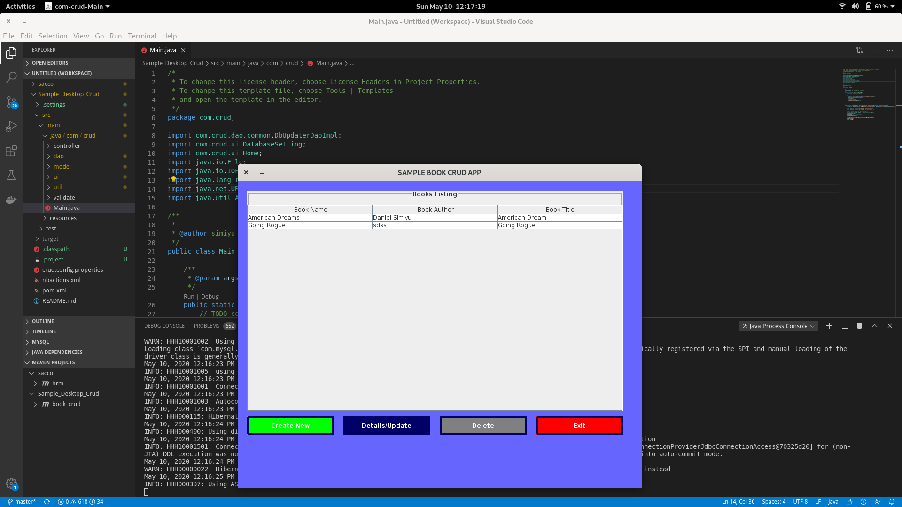

# BOOK CRUD

This is a sample CRUD Desktop application.
[]

Import it in your favourite IDE and run or create jar file by changing directory to this folder and run 'mvn clean compile package' and then 'java -jar target/book_crud.jar'

You will be prompted to set up either Mysql/Postgresql in your first run.
