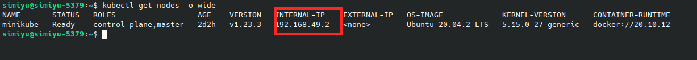

# Deploy spring boot on kubernetes

## Requirement
Make sure you have the following installed:
- Docker
- Docker compose
- minicube 
- kubectl
- maven
- Have a docker hub account

### Run app with docker-compose
For this just change directory to the project folder and run `sh docker-compose-runner.sh` on the terminal. For details open this file to see what it does.

### Deploy on kubernetes
- Change directory to `k8s` folder inside the project
- Open `k8s-cluster-runner.sh` file and replace `<docker-hub-username>` with your docker hub username.
- Open `sample-app-k8s-deployment.yaml` file and replace `<docker-hub-username>` with your docker hub username.
- while still in `k8s` folder run `sh k8s-cluster-runner.sh` on the terminal. This will build the spring boot application, build the docker image and push it to docker hub. And it will create a cluster with one node. Two pods and two services, one for postgres database and the other for spring boot application.
- Run `kubectl get all` to see how your cluster looks like.
[]

- And if everything looks okay run `kubectl get service` to all services and to find out on which port is spring boot app running on.
[]

- Then to find out the internal Ip address so we can consumer the spring boot APIs, run `kubectl get nodes -o wide`
[]

- So for my case I will be able to consume the APIs via endpoint `http://192.168.49.2:30268/api/v1/books/`
