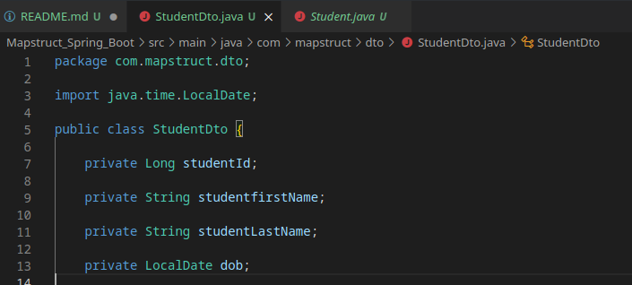
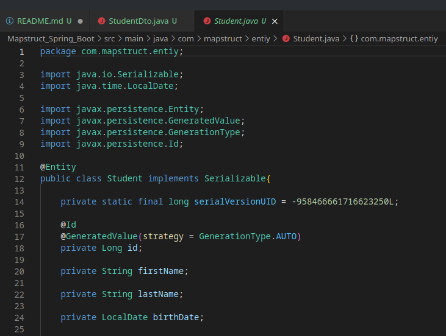

# Spring boot and mapstruct

As you may know its not advisable to expose your entities in your APIs. The best way is to use DTOs on your APIs and map the DTOs to your entity classes.
Mapstruct is one of many libraries you can use.

### To run
- Update `application.properties` file to match mysql database connection.
- When you are in the project folder run `mvn -DskipTests clean install && java -jar target/sampleMapstructDtoMapper.jar`

## Mapped classes

- DTO
[]

- Entity class
[]

## API Endpoint

You can consume the API via `http://127.0.0.1:8080/api/v1/students/` and it will require DTO payload instead of entity.