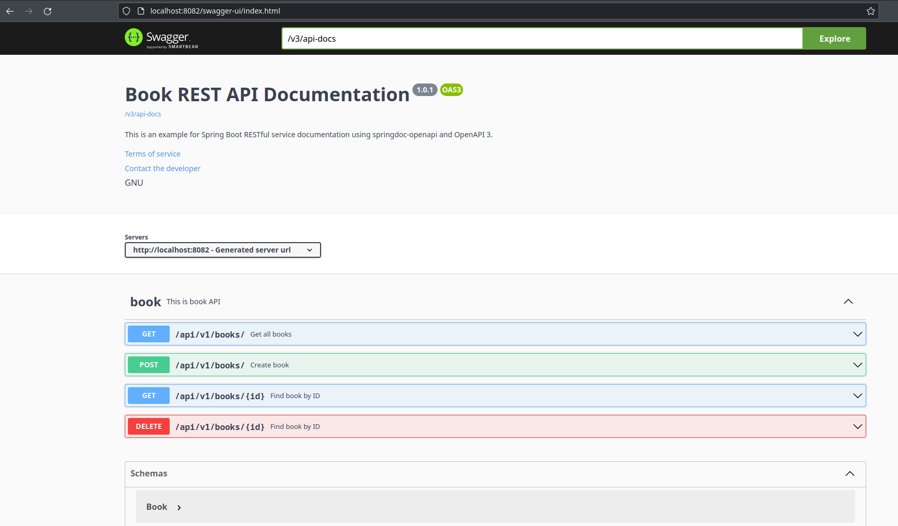

# Documenting a SpringBoot REST API with OpenAPI 3

This is a sample REST API documentation in Spring Boot CRUD API application. 

## Update
- Make necessary datasource updates in src/main/resources/application.properties

## Deploy Project
- Change directory to project folder and  run `mvn clean install` and the `java -jar target/openapi3.jar`.
- If you run the application, the api documentation url is `http://localhost:8082/swagger-ui/index.html` 

This is a swagger screen
[]

### From Developers

I am always happy to receive your feedback!
Find me on [Twitter](https://twitter.com/julian_geniuz)!
