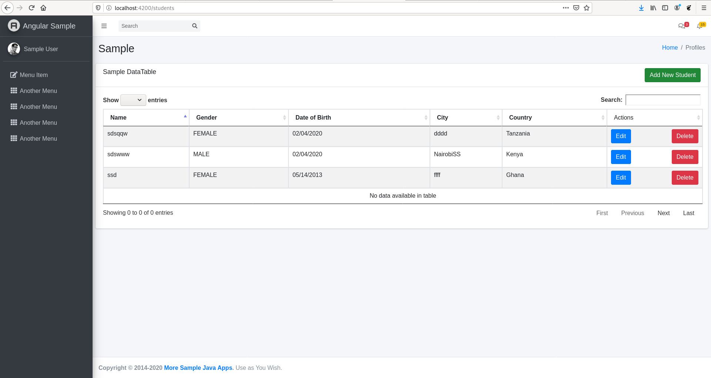

# Angular 9 Admin with Spring Boot REST API Authentication By Json Web Token (JWT)

This is a free admin template using Angular 9
[]

## Update
-Make necessary datasource setup in ./studentApi/src/main/resources/application.properties

## Server Side
Change directory to 'studentApi' folder and  run `mvn compile package && java -jar target/studentApi-1.jar` to start the spring boot

## Client Side
Change directory to 'Client' folder and  run `npm start` for a front-end dev server. Navigate to `http://localhost:4200/home`. You will redirected to login. Here you can go to signup page by clicking on 'Register a new user'.

## What's Included on client side
- Angular 9 & Typescript
- Bootstrap 4+ & CSS
- Spring Boot Backend Api
- Angular App Api Client
- Perform CRUD Operations

## Used Tech
- Spring Boot 2.2.6 Api
- Spring Security
- Json Web Token (JWT)
- Angular Client App using a bootstrap template
- JPA(Hibernate)
- Mysql
- JUnit 5

## Code scaffolding

Run `ng generate component component-name` to generate a new component. You can also use `ng generate directive|pipe|service|class|module`.

## Build

Run `ng build` to build the project. The build artifacts will be stored in the `dist/` directory. Use the `-prod` flag for a production build.

### From Developers

I am always happy to receive your feedback!
FInd me on [Twitter](https://twitter.com/julian_geniuz)!
