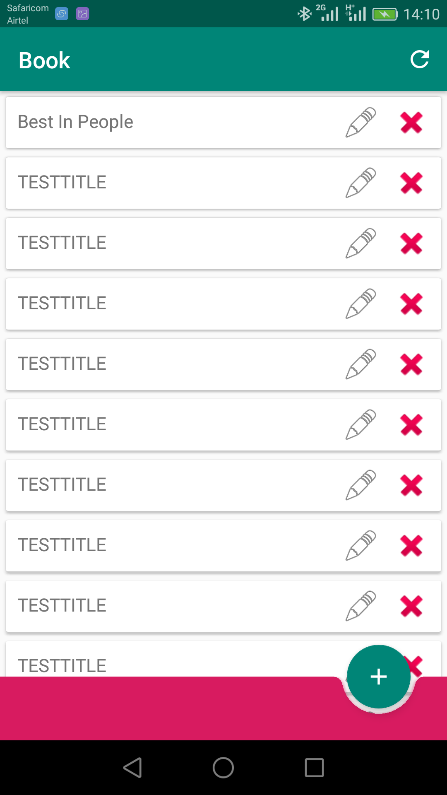
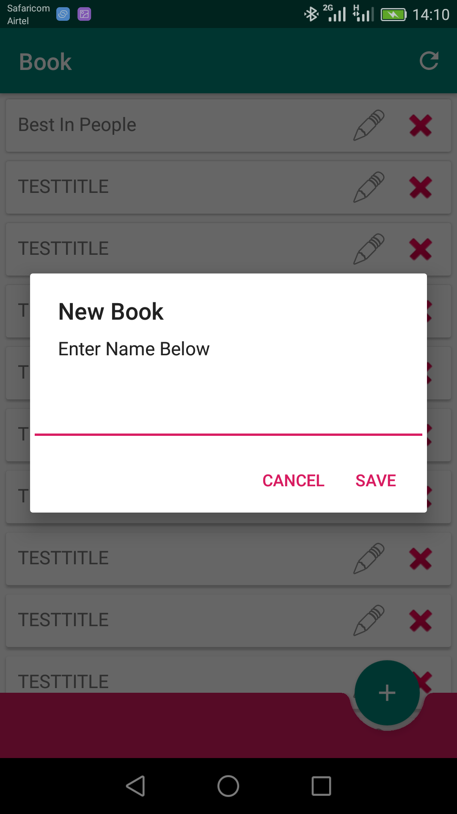
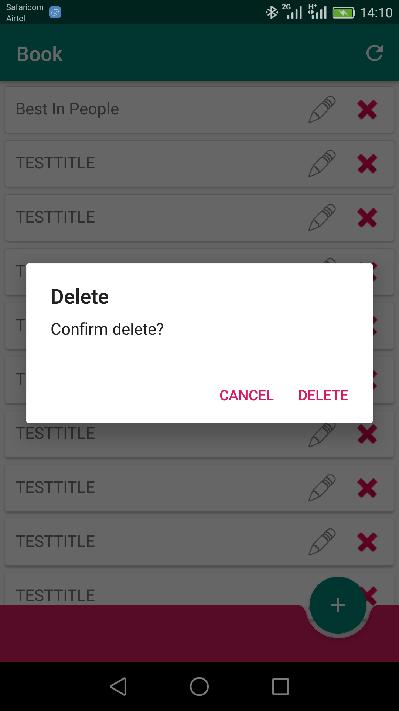

# SPRING BOOT API AND ANDROID API CLIENT

This is a sample Spring API CRUD application that runs on embedded tomcat server for android consumption. 

## Update
Make sure to update application.properties in the api according to your database settings.
Also open com.material.book.api.BookApiClient.kt in android app and update the Ip/host adress for the app to be able to connect to the api.

## Deploy Project
Change directory to project folder(bookApi folder) and  run `mvn clean compile package`  to compile and then `java -jar target/bookApi-1.0.jar`  to start the api. Then you can consume the api with the android app included.

## What's Included 
- Spring Boot Backend Api
- Andoid App Api Client
- Perform CRUD Operations

This is a listing
[]

This is a registration
[]

This is a delete screen
[]

## Used Tech
- Spring Boot 2.2.6 Api
- Android Client App using Kotlin and Retrofit
- JPA(Hibernate)
- Mysql
- JUnit 5

### From Developers

I am always happy to receive your feedback!
FInd me on [Twitter](https://twitter.com/julian_geniuz)!
