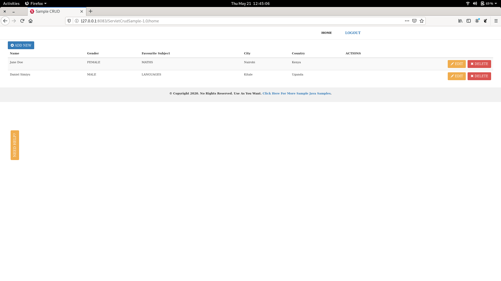
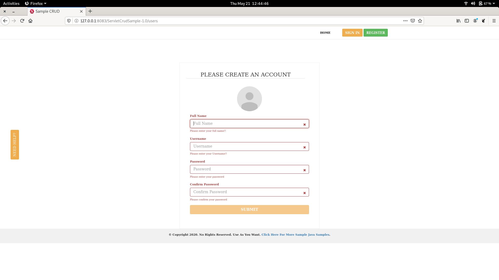
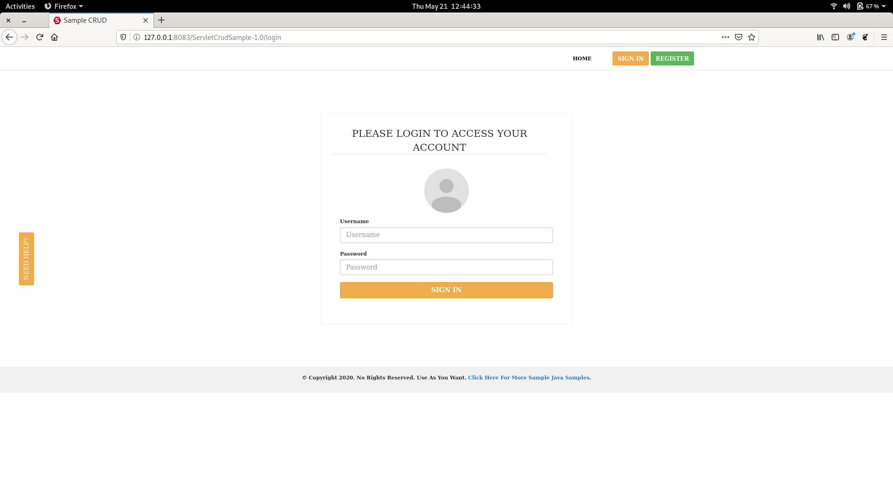

# STRUTS 2 JSP SAMPLE CRUD AND USER LOGIN

This is a sample servlet CRUD application that runs on tomcat server. 

## Update
-Make necessary datasource setup in src/main/resources/META-INF/persistence.xml

## Deploy Project
Change directory to project folder and  run `mvn clean install`  or (If you want to skip tests) `mvn clean install -Dmaven.test.skip=true`  to create war file.
Deploy the war file in tomcat application server and go to 'http://127.0.0.1:SERVER_PORT/WAR_FILE_NAME'. Mine is http://127.0.0.1:8083/strutsCrudSample

## What's Included 
- Create User
- Login to app
- Logout
- Perform CRUD Operations

This is a listing
[]

This is a user registration
[]

This is a login screen
[]

## Used Tech
- Struts 2
- Servlet
- JSP
- JPA(Hibernate)
- Mysql
- JUnit 5

### From Developers

I am always happy to receive your feedback!
FInd me on [Twitter](https://twitter.com/julian_geniuz)!
