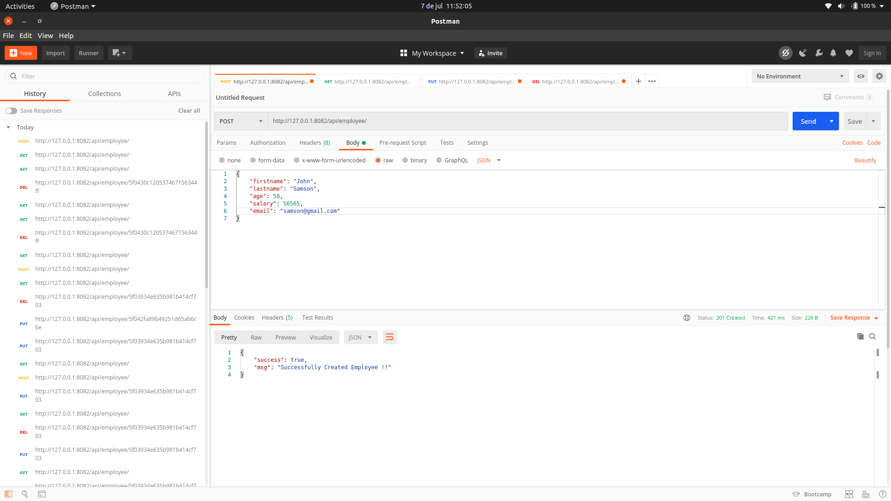
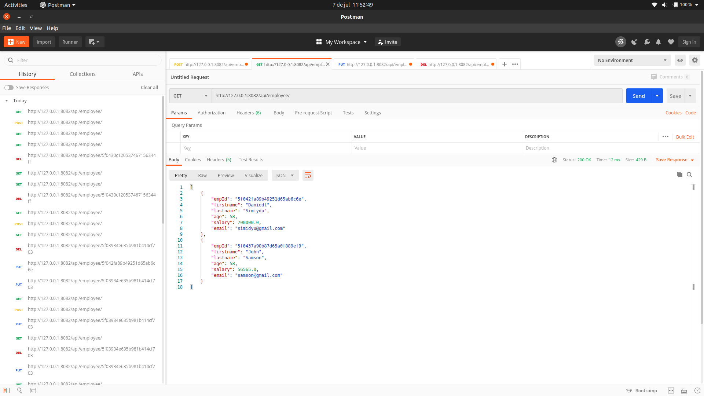
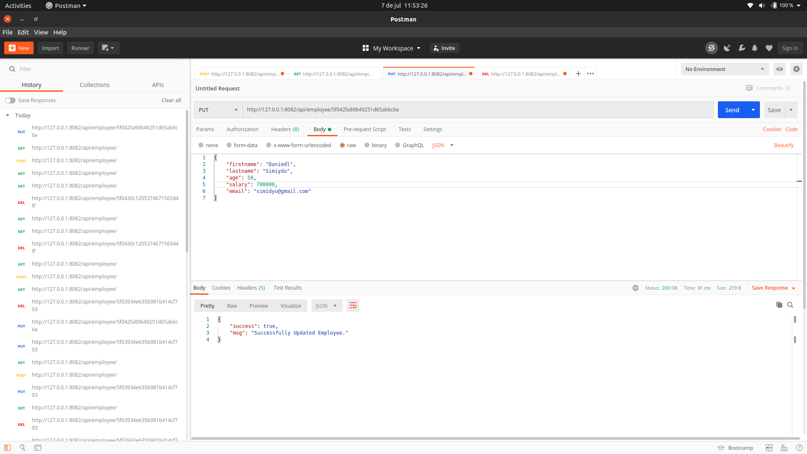
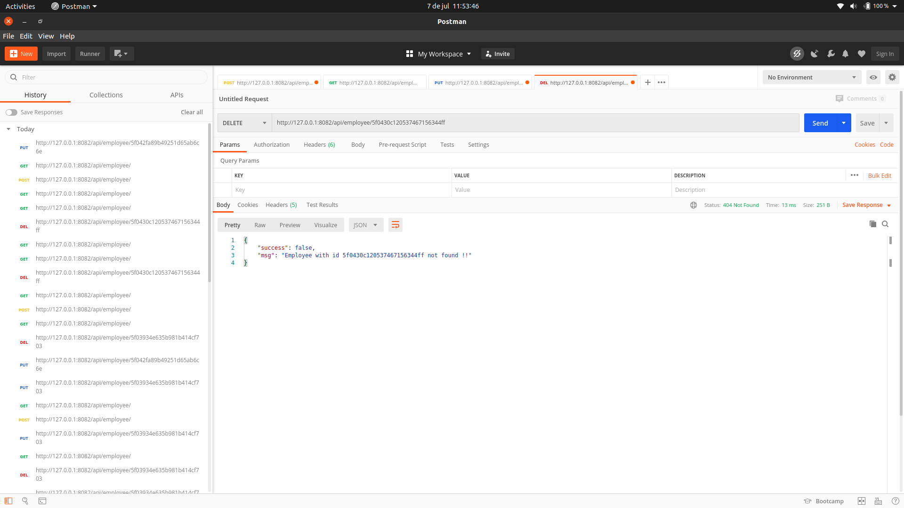

# SPRING BOOT AND MONGO DB SAMPLE CRUD

This is a sample Spring Boot Mongodb CRUD application that runs on tomcat server. 

## Update
-Make necessary datasource(mongo) setup changes in src/main/resources/application.properties

## Deploy Project
Change directory to project folder and  run `gradle bootRun`  or `gradle clean build && java -jar build/libs/springMongo-1.0.jar`  to create and deploy jar file.

## What's Included 
- Post request to create new record
- Get request to list records
- Put request to update records
- Delete request to remove records

This is a postman post request
[]

This is a postman get request
[]

This is a postman put request
[]

This is a postman delete request
[]

## Used Tech
- Spring Boot 2.3.1
- REST
- Mongo DB
- Gradle

### From Developers

I am always happy to receive your feedback!
FInd me on [Twitter](https://twitter.com/julian_geniuz)!
